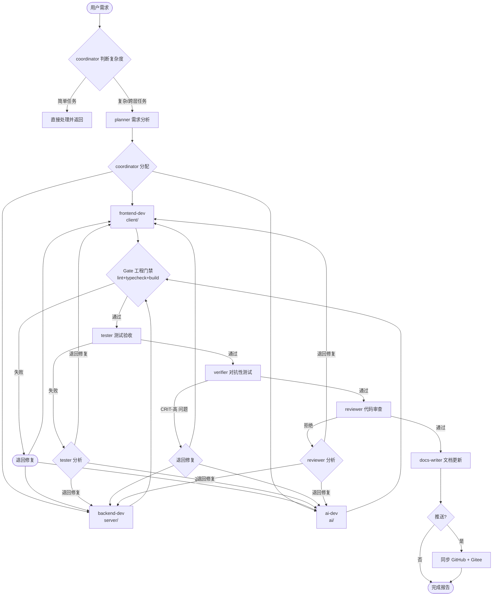
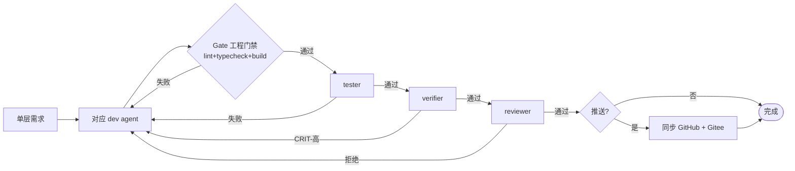
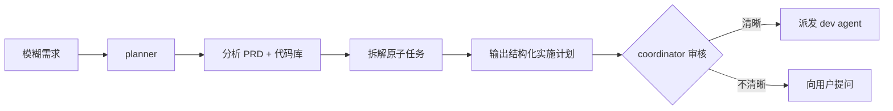
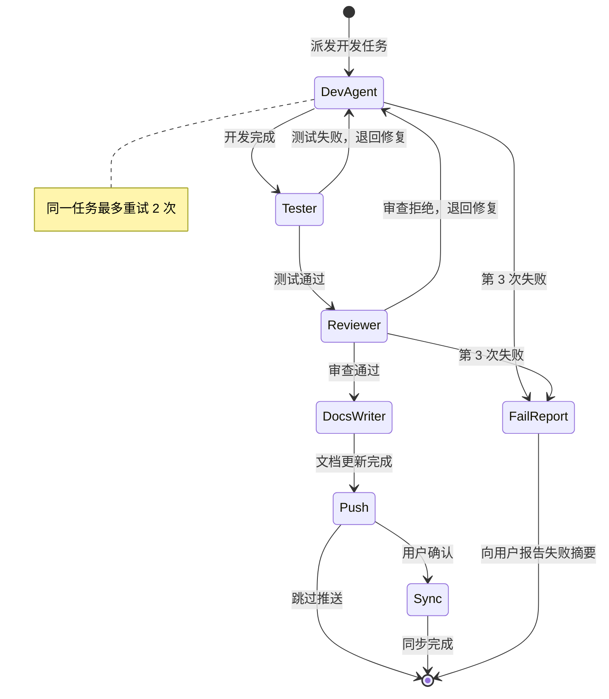

# Agent 工作流

> 本文档描述 童行 AI（Trip with Kids）项目的子智能体系统编排流程。
> 所有 Agent 定义见 `.opencode/opencode.json`，详细提示见 `.opencode/prompts/`。
> AI Agent 开发规范见 `docs/ai-agent-spec.md`，AI 层架构见 `docs/architecture/ai-layer.md`。

## 1. 概述

项目采用 **coordinator 调度 + 子 Agent 执行** 的编排模式。主 Agent 接收需求后，根据复杂度判决策略，按顺序派发给对应的子智能体，形成可追溯的开发流水线。

**技术栈**：Vue 3 + NestJS + LangChain + PostgreSQL + pgvector + Redis  
**目录结构**：

```
trip-planner/
├── client/        # 前端 — frontend-dev 操作
├── server/        # 后端 — backend-dev 操作
├── ai/            # AI Agent 层 — ai-dev 操作
└── docs/          # 文档 — docs-writer 操作
```

**核心原则**：

- **流水线不可跳过**：tester、verifier 和 reviewer 是必经环节
- **目录边界严格**：每个 dev agent 仅操作自己的目录
- **角色责任分离**：coordinator 只编排不写代码，tester/reviewer 只验证不修复
- **两次重试上限**：同一任务失败 2 次后向用户报告

## 2. 子智能体总览

| 名称             | 职责                                                 | 操作目录  | 模型              | 编辑权限    | 核心约束                       |
| ---------------- | ---------------------------------------------------- | --------- | ----------------- | ----------- | ------------------------------ |
| **coordinator**  | 调度协调器：接收需求、拆分子任务、按序派发、汇总结果 | 全栈调度  | deepseek-v4-flash | ❌ 禁止编辑 | 角色仅限编排调度               |
| **planner**      | 需求分析：分析 PRD 和代码库，输出实施计划            | 只读      | deepseek-v4-flash | ❌ 禁止编辑 | 只读，不创建/修改任何文件      |
| **frontend-dev** | Vue 3 前端开发（Composition API + Tailwind CSS）     | `client/` | deepseek-v4-flash | ✅ 完整编辑 | 始终使用 `<script setup>`      |
| **backend-dev**  | NestJS 后端开发（Prisma + PostgreSQL + Redis）       | `server/` | deepseek-v4-flash | ✅ 完整编辑 | 模块结构、标准响应格式         |
| **ai-dev**       | AI Agent 开发（LangChain + LangGraph + pgvector）    | `ai/`     | deepseek-v4-flash | ✅ 完整编辑 | 禁止 PII 泄漏                  |
| **tester**       | 测试验收：运行测试套件、检查覆盖率                   | 只读      | deepseek-v4-flash | ❌ 禁止编辑 | 运行全部测试（回归检查）       |
| **verifier**     | 对抗性测试：尝试破坏实现，发现安全漏洞和边界缺陷     | 只读      | deepseek-v4-flash | ❌ 禁止编辑 | 每个发现附带复现步骤           |
| **reviewer**     | 代码审查：安全、性能、可维护性、可读性               | 只读      | deepseek-v4-pro   | ❌ 禁止编辑 | 引用精确文件:行号              |
| **docs-writer**  | 知识库工程师：API 文档、架构文档、报告等             | `docs/`   | deepseek-v4-flash | ✅ 文档编辑 | 上下文自包含、YAML frontmatter |

## 3. 核心工作流

### 3.1 完整开发流水线（dev-cycle）

适用于跨层、多步骤的复杂功能开发。



### 3.2 单层任务流程

适用于仅涉及单一层的功能开发（如仅后端 API 变更）。



### 3.3 需求分析流程（plan-task）

适用于需求不清晰或需要先输出实施计划的场景。



## 4. 各 Agent 详细工作流

### 4.1 coordinator（调度协调器）

| 项目         | 说明                                                                                        |
| ------------ | ------------------------------------------------------------------------------------------- |
| **触发条件** | 用户直接调用或 `dev-cycle` 命令触发                                                         |
| **输入**     | 用户需求描述                                                                                |
| **输出**     | 子 Agent 执行结果汇总报告                                                                   |
| **可用技能** | prompt-engineering, executing-plans, finishing-a-development-branch, requesting-code-review |

**工作步骤**：

1. 理解 incoming 需求
2. 判断复杂度：
   - 简单（单文件 bug 修复、CSS 调整、文案修改）→ 直接处理，不派发
   - 复杂 → 进入步骤 3-6
3. 将需求拆解为原子子任务，确定依赖关系
4. 按顺序通过 `task()` 工具派发给子 Agent
5. 收集各子 Agent 结果，失败时重新派发
6. 向用户报告摘要

**派发规则**：

| 目标 Agent   | 派发条件                      |
| ------------ | ----------------------------- |
| planner      | 需求不清晰，需要先分析        |
| frontend-dev | 变更涉及 `client/`            |
| backend-dev  | 变更涉及 `server/`            |
| ai-dev       | 变更涉及 `ai/`                |
| tester       | dev agent 完成后**必须**派发  |
| reviewer     | tester 通过后**必须**派发     |
| docs-writer  | 每次 dev-cycle 完成后强制执行 |

### 4.2 planner（需求分析）

| 项目         | 说明                                                    |
| ------------ | ------------------------------------------------------- |
| **触发条件** | coordinator 派发或 `plan-task` 命令                     |
| **输入**     | 用户需求 / PRD                                          |
| **输出**     | 结构化实施计划（Markdown）                              |
| **可用技能** | prd, brainstorming, writing-plans, trip-task-decomposer |

**工作步骤**：

1. 阅读 `docs/PRD.md` 和现有代码，理解上下文
2. 识别需变更内容：创建/修改的文件、新增 API、需构建的组件
3. 按依赖关系拆解为有序任务
4. 每个任务标注：所属目录（client/server/ai）、预估工作量、涉及的关键文件
5. 输出结构化实施计划

**输出格式示例**：

```markdown
## 实施计划

### 阶段 1：数据库与 API

- [ ] 添加行程表迁移 | 负责人：backend-dev | 涉及文件：prisma/schema.prisma

### 阶段 2：前端页面

- [ ] 创建行程列表页 | 负责人：frontend-dev | 涉及文件：views/TripList.vue
```

### 4.3 frontend-dev（前端开发）

| 项目         | 说明                                                                                                                                                |
| ------------ | --------------------------------------------------------------------------------------------------------------------------------------------------- |
| **触发条件** | coordinator 派发，变更涉及 `client/`                                                                                                                |
| **输入**     | 功能需求 / 实施计划相关任务                                                                                                                         |
| **输出**     | 实现的 Vue 组件、测试、路由配置                                                                                                                     |
| **可用技能** | vue-best-practices, vue-patterns, vue-pinia-best-practices, vue-router-best-practices, tailwindcss, frontend-design, performance-optimization, pnpm |

**工作步骤**：

1. 理解需求，阅读相关的现有组件
2. 遵循现有模式实现代码
3. 编写全面测试（单元 + 组件 + 集成）
4. 验证所有测试通过
5. 性能检查：路由懒加载、图片懒加载、无包体积膨胀

**约束**：

- 始终使用 Composition API + `<script setup>`，禁止 Options API
- 测试使用 Vitest + Playwright，使用语义化选择器
- 新增依赖前用 Context7 查询最新版本

### 4.4 backend-dev（后端开发）

| 项目         | 说明                                                                                                                                                                        |
| ------------ | --------------------------------------------------------------------------------------------------------------------------------------------------------------------------- |
| **触发条件** | coordinator 派发，变更涉及 `server/`                                                                                                                                        |
| **输入**     | 功能需求 / 实施计划相关任务                                                                                                                                                 |
| **输出**     | 实现的 NestJS 模块、API 端点、测试                                                                                                                                          |
| **可用技能** | nestjs-patterns, backend-patterns, prisma-patterns, postgresql-optimization, postgres-best-practices, redis-patterns, pgvector-semantic-search, zod-validation-expert, pnpm |

**工作步骤**：

1. 理解需求，阅读现有模块
2. 遵循 NestJS 模块结构实现 API/服务/模块
3. 编写全面测试（单元 + 集成）
4. 验证所有测试通过
5. 性能检查：N+1 预防、错误处理、PII 保护

**约束**：

- 使用 NestJS 模块结构（module/controller/service/guard）
- 所有 API 响应使用标准格式：`{ success: boolean, data?: T, error?: string }`
- 不实现支付/交易/票务功能（MVP 范围外）
- 外部预订链接指向平台搜索页，不得指向具体结果页

### 4.5 ai-dev（AI Agent 开发）

| 项目         | 说明                                                                                                                                                                                                                                                         |
| ------------ | ------------------------------------------------------------------------------------------------------------------------------------------------------------------------------------------------------------------------------------------------------------ |
| **触发条件** | coordinator 派发，变更涉及 `ai/`                                                                                                                                                                                                                             |
| **输入**     | Agent 功能需求 / 实施计划相关任务                                                                                                                                                                                                                            |
| **输出**     | 实现的 deepAgent / LangGraph Agent 工作流                                                                                                                                                                                                                    |
| **可用技能** | ai-product, deep-agents, langgraph, langsmith, rag-engineer, rag-implementation, prompt-engineering, prompt-engineering-patterns, prompt-optimizer, context-engineering, harness-engineering, pgvector-semantic-search, verification-before-completion, pnpm |

**参考文档**：

- `docs/ai-agent-spec.md` — AI Agent 开发完整规范（十二大章节）
- `docs/architecture/ai-layer.md` — AI 层架构设计（模块、数据流、状态定义、MCP 集成）

**工作步骤**：

1. 阅读 `docs/ai-agent-spec.md` 相关章节和 `docs/architecture/ai-layer.md`
2. 按规范调用各技能：

   ```
   {skill:prompt-engineering-patterns} → 生成/优化 prompt 文件 → ai/prompts/
   {skill:context-engineering}         → 构建 Agent 分层上下文
   {skill:harness-engineering}         → 记录失败模式
   {skill:deep-agents}                 → createDeepAgent 实现
   {skill:langgraph}                   → StateGraph 编排
   ```

3. 遵循 `docs/ai-agent-spec.md` 实现 MCP 工具集成（使用 `@langchain/mcp-adapters` 的 `MultiServerMCPClient`）
4. 编写测试覆盖：Agent 路由、工具调用、RAG 检索、输出格式化、MCP 降级
5. 验证所有测试通过
6. 检查：PII 泄漏、幻觉防护、流式输出、成本效率、MCP 超时处理

**架构约定**：

```
用户输入 → IntentRouter（deepAgent 意图分类）
              ├─ plan → TravelPlanner（LangGraph StateGraph 编排）
              │           ├─ TransportAgent（deepAgent + 飞常准/12306/高德 MCP）
              │           ├─ AccommodationAgent（deepAgent）
              │           ├─ AttractionAgent（deepAgent + 高德 MCP）
              │           └─ BudgetAgent（deepAgent）
              ├─ modify → TravelModifier（deepAgent 全量重生成）
              └─ qa → KnowledgeQA（deepAgent + pgvector RAG）
```

**约束**：

- 禁止向 LLM 提供商发送 PII（手机号、姓名等），调用 `ai/utils/safety.ts` 脱敏
- 输出结构化 JSON，强制 Zod 校验
- MCP 工具配置走 `ai/config/mcp.ts` + `.env`，禁止硬编码
- 外部预订链接仅使用平台搜索页 URL，标注 🡕 跳转标识
- 知识库内容必须有来源归属
- 所有 prompt 外部化至 `ai/prompts/`，禁止代码内联

### 4.6 tester（测试验收）

| 项目         | 说明                                                                   |
| ------------ | ---------------------------------------------------------------------- |
| **触发条件** | dev agent 完成后，coordinator 强制派发                                 |
| **输入**     | dev agent 的变更集                                                     |
| **输出**     | 测试报告（通过/失败 + 覆盖率）                                         |
| **可用技能** | tdd-workflow, systematic-debugging, debugging-and-error-recovery, pnpm |

**工作步骤**：

0. **工程门禁检查**（必须在测试前执行）：
   - 在项目根目录执行 `pnpm check`（= `pnpm lint && pnpm typecheck && pnpm -r build`）
   - 任一失败 → 退回对应 dev agent 修复，不继续测试
1. 识别变更的包（client/server/ai）
2. 检查对应包是否存在测试套件：
   - 存在测试 → 运行 `pnpm --filter <pkg> run test`
   - 无测试套件（如 Phase 1 阶段）→ 降级为仅验证工程门禁通过，报告"无测试套件，仅门禁通过"
3. 存在测试时，运行对应包的完整测试套件：
   - 前端：`pnpm --filter client run test`
   - 后端：`pnpm --filter server run test`
   - AI：`pnpm --filter ai run test`
4. 如果有测试失败，分析失败输出并报告根因
5. 全部通过后，运行覆盖率检查：`pnpm --filter <pkg> run test:coverage`
6. 验证覆盖率阈值：分支 >= 80%、函数 >= 80%、行 >= 80%、语句 >= 80%

**报告格式**：

```markdown
## 测试报告

### 包：client

- 测试：24 通过，0 失败
- 覆盖率：行 87.2%，分支 83.1%，函数 91.5%
- 结论：通过
```

### 4.7 verifier（对抗性测试）

| 项目         | 说明                                                         |
| ------------ | ------------------------------------------------------------ |
| **触发条件** | tester 通过后，coordinator 强制派发                          |
| **输入**     | dev agent 的变更集                                           |
| **输出**     | 对抗性测试报告（漏洞/边界/攻击面）                           |
| **可用技能** | code-reviewer, systematic-debugging, typescript-expert, pnpm |

**工作步骤**：

1. 阅读变更文件，理解代码上下文
2. 执行输入边界爆破：空值、超长值、特殊字符、非预期类型
3. 分析安全攻击面：权限绕过、IDOR、路径遍历
4. 检查竞态条件和降级场景
5. 记录每个尝试过的攻击路径（无论成功与否）
6. 输出对抗性测试报告

**报告格式**：

```markdown
## 对抗性测试报告

### 审查文件：[列表]

### 发现的问题：

- [CRIT-高] 可直接利用的漏洞 | 文件:行号
- [CRIT-中] 需特定条件触发的缺陷 | 文件:行号
- [CRIT-低] 安全加固建议 | 文件:行号

### 结论：安全 / 需修复 / 有风险
```

### 4.8 reviewer（代码审查）

| 项目         | 说明                                                          |
| ------------ | ------------------------------------------------------------- |
| **触发条件** | verifier 通过后，coordinator 强制派发                         |
| **输入**     | dev agent 的变更文件                                          |
| **输出**     | 代码审查报告                                                  |
| **可用技能** | code-reviewer, typescript-expert, receiving-code-review, pnpm |

**审查维度**：

| 维度     | 检查项                                           |
| -------- | ------------------------------------------------ |
| 安全性   | PII 泄漏、SQL 注入、JWT 校验、输入验证           |
| 性能     | N+1 查询、懒加载、数据库索引、LLM 缓存           |
| 可维护性 | 编码约定遵循、重复逻辑提取、错误处理一致、配置化 |
| 测试     | 代码路径覆盖、测试有意义、边界情况               |

**报告格式**：

```markdown
## 代码审查

### 审查文件：[列表]

### 问题清单：

- [SEV-高] 问题描述 | 文件:行号
- [SEV-中] 问题描述 | 文件:行号
- [SEV-低] 建议 | 文件:行号

### 结论：通过 / 需修改 / 拒绝
```

### 4.9 docs-writer（知识库工程师）

| 项目         | 说明                                    |
| ------------ | --------------------------------------- |
| **触发条件** | 每次 dev-cycle 完成后强制执行           |
| **输入**     | 变更摘要、代码变更集                    |
| **输出**     | 更新后的文档文件                        |
| **可用技能** | docs-write, prompt-engineering-patterns |

**工作步骤**：

1. 确定目标读者和文档类型
2. 选择最匹配的文档模板
3. 撰写/更新文档
4. 调用 `memory_write` 记录关键变更（decision / config / bugfix / lesson）
5. 按质量检查清单逐项确认

**文档类型覆盖**：

- 项目级：README、API 文档、PRD、架构文档、数据库设计、部署指南
- 功能完成文档（auto-generated）：每次 dev-cycle 完成后的强制产出
- 状态类：完成情况报告、进度跟踪、版本发布说明
- 问题类：Bug 修复报告、RCA、性能分析报告
- 知识库：ADR、开发规范、技术债记录、AI 交接文档
- 流程类：代码审查指南、CI/CD 流程、Git 工作流规范

**功能完成文档规则**：

- **新功能** → 新建 `docs/features/<功能名>.md`（按 `docs/features/feature-template.md` 模板）
- **已有功能新增/修改** → 直接在已有文档补充
- **Bug 修复** → 直接在已有文档补充

**约束**：

- 每个文档必须包含 YAML frontmatter
- 文档统一存放 `docs/` 目录
- 上下文自包含，不对读者做预设

## 5. 失败处理与重试机制



| 失败场景                             | 处理方式                 | 重试上限 |
| ------------------------------------ | ------------------------ | -------- |
| 工程门禁（lint/typecheck/build）失败 | 退回 dev agent 修复      | 2 次     |
| tester 报告失败                      | 退回 dev agent 修复      | 2 次     |
| 覆盖率低于 80%                       | 退回 dev agent 补充测试  | 2 次     |
| verifier 报告 CRIT-高 问题           | 退回 dev agent 修复      | 2 次     |
| reviewer 结论"拒绝"                  | 退回 dev agent 修复      | 2 次     |
| 第 3 次仍失败                        | 向用户报告失败摘要和根因 | —        |

## 6. 自定义命令映射

| 命令              | 派发目标    | 触发场景       | 说明                                                                                  |
| ----------------- | ----------- | -------------- | ------------------------------------------------------------------------------------- |
| `dev-cycle`       | coordinator | 日常开发       | 完整开发流水线：dev → gate → tester → verifier → reviewer → docs-writer+memory → push |
| `check-gates`     | 直执行      | 工程门禁       | 执行 `pnpm check`（lint + typecheck + build），手动确认门禁状态                       |
| `plan-task`       | planner     | 需求不清晰     | 分析需求，输出实施计划                                                                |
| `review-code`     | reviewer    | 代码审查       | 只读审查指定代码                                                                      |
| `add-dep`         | build       | 新增依赖       | 用 Context7 查最新版本后安装                                                          |
| `compress-memory` | 脚本        | 记忆库接近上限 | 导出 → 聚类 → 合并 → 导入 → 清理                                                      |

## 7. 跨 Agent 协作规范

### 7.1 目录边界

| Agent        | 可读               | 可写      |
| ------------ | ------------------ | --------- |
| coordinator  | 全项目             | ❌        |
| planner      | 全项目             | ❌        |
| frontend-dev | `client/`, `docs/` | `client/` |
| backend-dev  | `server/`, `docs/` | `server/` |
| ai-dev       | `ai/`, `docs/`     | `ai/`     |
| tester       | 全项目             | ❌        |
| verifier     | 全项目             | ❌        |
| reviewer     | 全项目             | ❌        |
| docs-writer  | 全项目             | `docs/`   |

### 7.2 信息传递格式

- **dev agent → tester**：变更文件列表 + 测试运行命令
- **tester → coordinator**：测试报告（通过/失败 + 覆盖率数据）
- **verifier → coordinator**：对抗性测试报告（漏洞清单 + 结论）
- **reviewer → coordinator**：审查报告（问题清单 + 结论，含 verifier 发现）
- **coordinator → user**：任务摘要 + 各阶段结果

### 7.3 依赖安装规范

所有 dev agent 新增包之前，必须：

1. 先用 Context7 查询最新版本：
   - `context7_resolve-library-id` 获取库 ID
   - `context7_query-docs` 确认最新稳定版本和兼容性
2. 安装命令：`pnpm add <pkg>@<version> --filter <client|server|ai>`
3. 安装后运行 `pnpm outdated -r` 确认无冲突
4. 先在 `pnpm-workspace.yaml` catalogs 检查是否已存在
5. 共享依赖使用 `catalog:` 协议

### 7.4 测试标准

| 层            | 测试框架            | 覆盖要求                                      |
| ------------- | ------------------- | --------------------------------------------- |
| 前端 (client) | Vitest + Playwright | 正常路径 + 错误状态 + 加载状态 + 边界情况     |
| 后端 (server) | Vitest              | 成功路径 + 400/401/403/404                    |
| AI (ai)       | Vitest              | Agent 路由 + 工具调用 + RAG 检索 + 输出格式化 |

覆盖率阈值：分支 >= 80%、函数 >= 80%、行 >= 80%、语句 >= 80%

---

> 文档维护：当新增/修改子 Agent 或调整工作流时，同步更新本文档。
